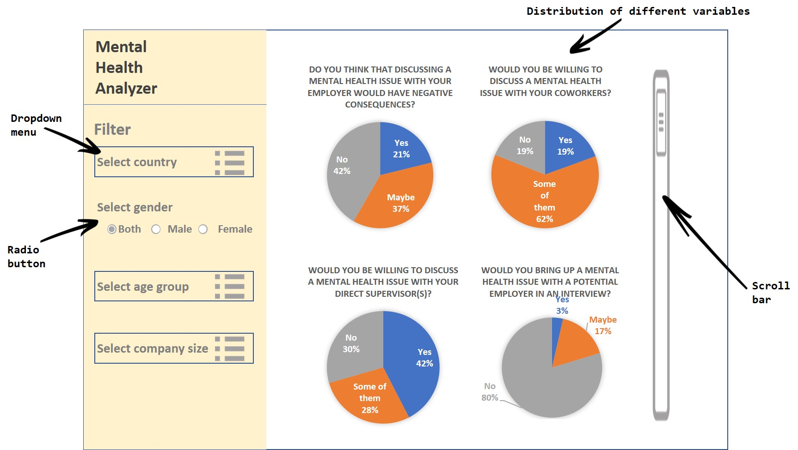

# Mental Health Analyzer
-------------------------------------------------
# Team
| Name  | Slack Handle | Github.com |
| :------: | :---: | :----------: |
| Jingyun Chen | `@Jingyun` | `@jc2592` |
| Gilbert Lei | `@Gilbert Lei` | `@gilbertlei` |

# Overview

Mental health issues in the workplace matters because it not only affects the employee’s own life but also reduces productivity. According to a study from [Employers’ Health Coalition](https://www.workplacestrategiesformentalhealth.com/mental-health-issues-facts-and-figures), employees with any unaddressed physical or mental issues would cost Canadian businesses more than 15  billion dollars per year. To tackle this issue, we aim to build an interactive data visualization app that allows users, especially for HR at tech companies to explore a dataset of a mental health survey. The app will allow users to explore the distribution of the attitudes of employees towards different potential problems related to mental health in the workplace by specifying their countries, age groups, size of companies, as well as the gender of employees. We hope that users could have a better understanding of the problem and make some improvements to their current employees’ well-being programs.

# Description of data

In this project, we will be visualizing a mental health survey data in tech workspace sourced from the [Kaggle dataset](https://www.kaggle.com/osmi/mental-health-in-tech-survey). It contains around 1000 observations that measure the attitude of each respondent towards mental health issues. Each entry has 10 variables which describe the respondent (Age, Gender, Country), his/her employer (no_employees, care_options, wellness_program), and his/her attitude towards the mental health issues at work (mental_health_consequence, coworkers, supervisors, mental_health_interview).

# Usage scenario & tasks

Nancy is an HR executive at a multinational Fortune 500 tech company and she wants to improve the employees’ wellness program, particularly focusing on their mental health. She wants to be able to explore the dataset in order to gain some insights into employees’ attitudes towards mental health issues and identify the most critical issues which help her frame her improvement plan.

After logging on to the  “Mental Health Analyzer app”, she will see a panel with two parts. On the left side, there are several filters; on the other side, there is a main panel with the distribution of different variables. She can modify the country, gender, age group, and company size and see the changes in the distribution of the variables on the main panel. Nancy may notice that “mental_health_interview” appears to be the most critical issue. One chart shows that only 3% people said they would bring up a mental health issue in a job interview. Nancy hypothesizes that interviewees may be afraid of receiving negative consequences if they choose to mention their mental health issues. The finding may inspire her to dig further into this issue.

# Description of your app / sketch

The app contains a landing page that shows the distribution of the variables (treatment, supervisor, mental_health_interview, etc.). On the left side of the panel, users can filter the dataset by country, gender, age group, and/or company size using the drop-down menus and/or the radio button. Moreover, users can compare the distribution of different variables by scrolling through the main panel on the right.

