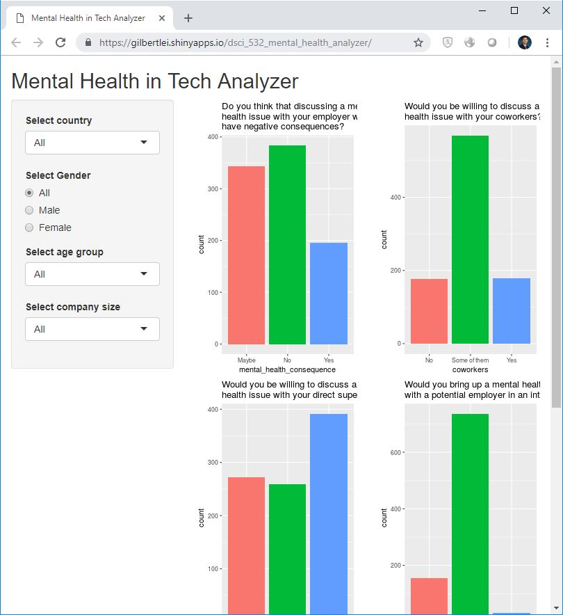
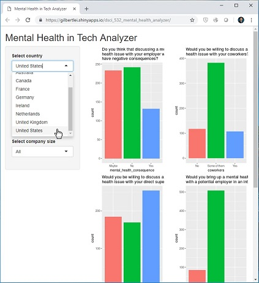
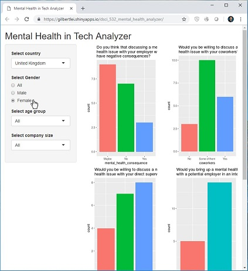
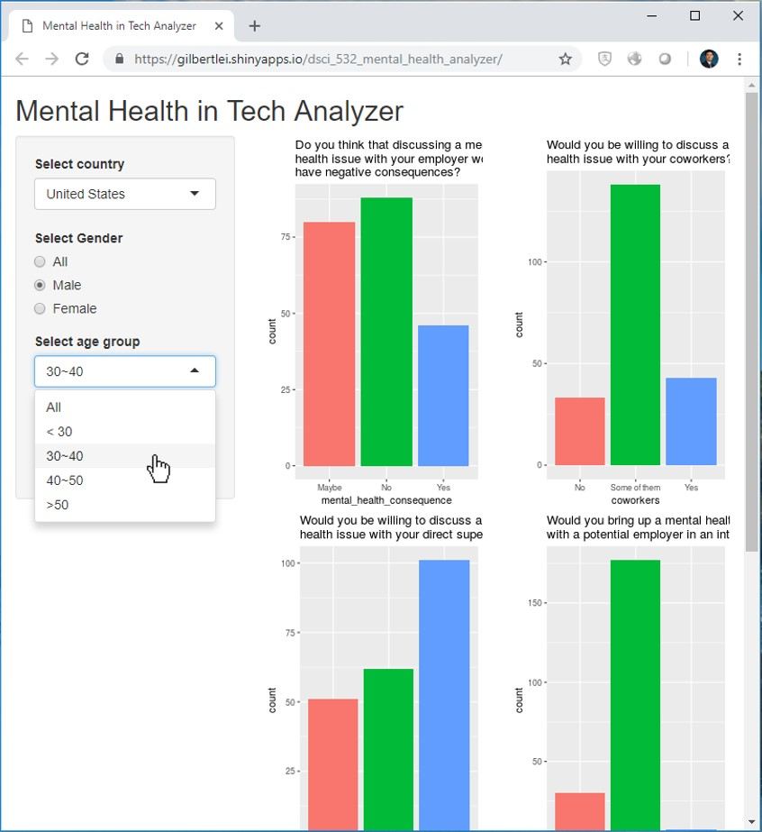
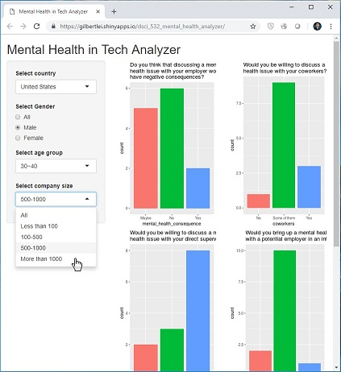
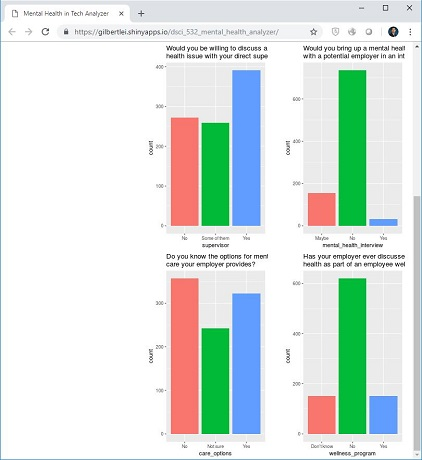

# Mental Health Analyzer
-------------------------------------------------
# Team
| Name  | Slack Handle | Github.com |
| :------: | :---: | :----------: |
| Jingyun Chen | `@Jingyun` | `@jchen9314` |
| Gilbert Lei | `@Gilbert Lei` | `@gilbertlei` |

# Rationale

As mentioned in the Proposal, we aim to build an interactive data visualization app that allows users, especially for HR at tech companies to explore a dataset of a mental health survey. The app will allow users to explore the distribution of the attitudes of employees towards different potential problems related to mental health in the workplace by specifying their countries, age groups, size of companies, as well as the gender of employees.  

We almost followed our initial idea in building this app in Milestone 2. However, there are two main changes we made at this stage. Initially, in the country drop-down menu on the left side of the panel,  users have 48 countries to select from. It turns out that most of the countries have only 1-2 responses, which would influence our interactive visualization. So, we decided to remove them and for now, the number of countries available is 9 instead of 48. The second issue we addressed is that we implemented the distributions with a bar chart in lieu of a pie chart in the main panel. We feel that this is more clear and easier for users to discover the distribution of the variables instead of the proportion of the variables.

# Functionality

This app is deployed at https://gilbertlei.shinyapps.io/dsci_532_mental_health_analyzer/. It can be accessed through any mainstream browser on PCs, cell phones or tablets. After opening the link, we can see the landing page, as shown in below image.  
   

This landing page has two parts: sidebar on the left and main panel on the right. On the sidebar, there are four filters, using which we can filter the data for analysis. On the main panel, there are in total six bar charts. Each bar chart shows an analysis on one specific area related to high tech employees' opinion on mental health issue. Below are four screen shots showing how to use each of the four filters on the sidebar.   
    

    

Usually, the six bar charts won't be able to show on a single page. We can use the scroll bar to scroll down the page and see bar charts that are not visible on the first page. Below image shows what we can see when we scroll down the page.  
  

# Next Steps

We want to make this app a user-friendly application that helps users solve their problems. Due to the short time frame, there are several tasks we don’t have enough time to implement in this period would consider in the future. First of all, in the current main panel, the title of each bar chart is essential as it is the description of the variable. However, the title is really long which users might not want to see while exploring the distribution. Thus, we decide to shorten the title for each chart and may add a feature that the concrete description of the variable can be shown in a floating window when users move their mouses to the title. Then, there are somewhat too many bar charts shown on one page and users have to scroll down the page to discover all the charts. In the future, we may split them into two pages by adding a new tab so as to help them discover different types of variables. Finally, as an visualization app, we will implement better aesthetics by adding a colorful background and using color panels that are more friendly to people with color-blinded, etc.

